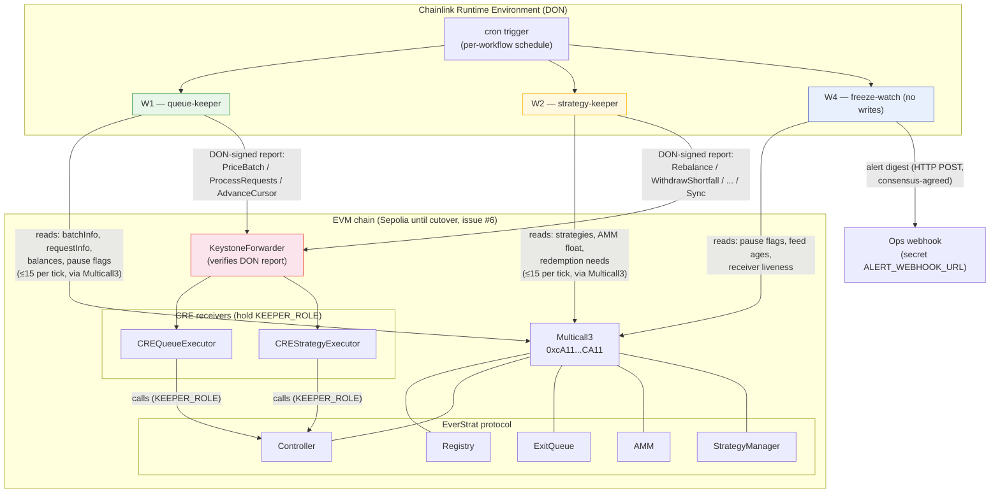
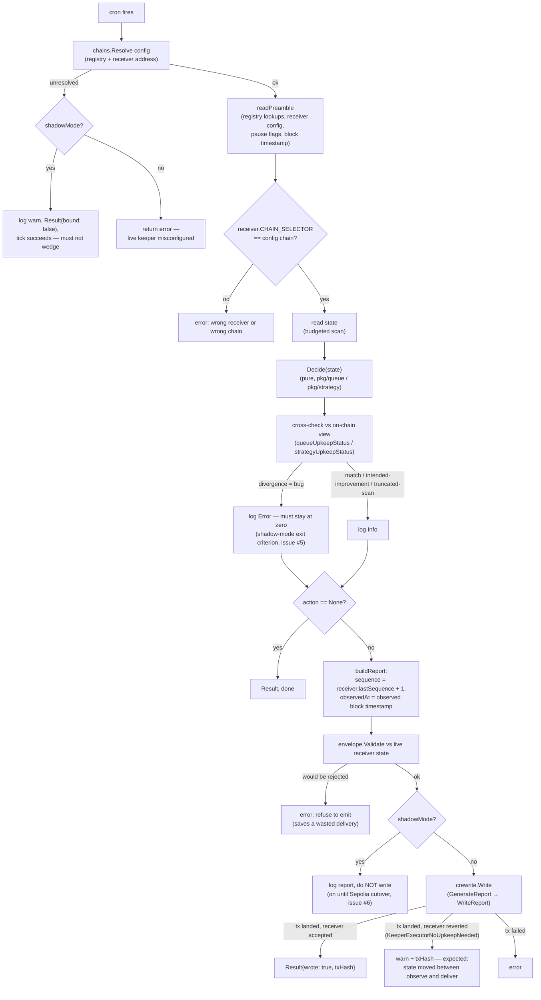

# 01 — System overview

How the three workflows in this repo relate to the Chainlink DON and the
EverStrat contracts. Files: `queue-keeper/`, `strategy-keeper/`, `freeze-watch/`,
`pkg/*`, and the receivers in
[`everstrat-xyz/contracts`](https://github.com/everstrat-xyz/contracts).

## The shared tick shape (W1 and W2)

Both keepers run the same skeleton every cron fire — see `queue-keeper/main.go`
and `strategy-keeper/main.go`:

Two clocks, deliberately:

| Time source | Used for |
| --- | --- |
| `evmread.BlockTimestamp` (observed block) | `observedAt`, batch ages, sync age — anything compared against contract state |
| `runtime.Now()` (DON wall clock) | only `Validate`'s delivery-time argument |

The receiver rejects `observedAt > block.timestamp` with zero tolerance, so a
wall clock even one second ahead of the chain would fail *every* report.
