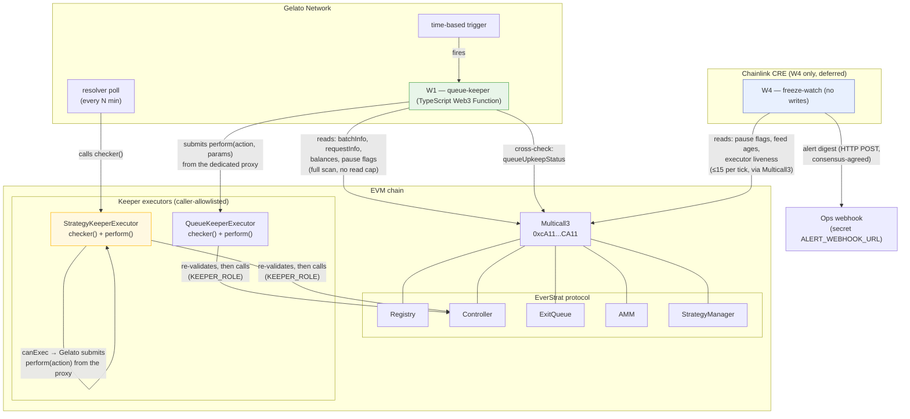
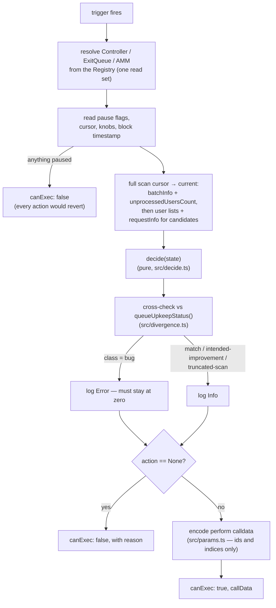

# 01 — System overview

How the components in this repo relate to Gelato and the EverStrat contracts.
Files: `web3-functions/queue-keeper/`, `freeze-watch/`, `pkg/*`, and the
executors in
[`everstrat-xyz/contracts`](https://github.com/everstrat-xyz/contracts).

W1/W2 moved off Chainlink CRE when Automation was sunset and CRE turned out
not to be permissionless. W4 (freeze-watch) still runs on CRE pending its own
migration (deferred).

## Why W1 is off-chain and W2 is not

The split is forced by the contracts, not a preference:

- `QueueKeeperExecutor._processReport` validates a `ProcessRequests` claim
  **per batch with no scan window**, so a Web3 Function scanning past the
  on-chain view's 25-batch `MAX_BATCH_SCAN` finds work the resolver
  structurally cannot — and the executor accepts it. That depth is W1's whole
  value.
- `StrategyKeeperExecutor._processReport` re-derives every quantity with the
  **same bounded helpers** its view uses, so a "truer" off-chain number would
  be rejected on arrival. Its own `checker()` is therefore exactly as good as
  any off-chain decider could be — so that is what Gelato polls.

## The W1 tick shape

`web3-functions/queue-keeper/index.ts`:

One clock, deliberately: `state.now` is the observed block's timestamp, never
`Date.now()` — batch ages are compared against `createdAt` values recorded
from `block.timestamp`, and a wall clock even a second ahead of the chain
would skew every `minBatchAge` check.
