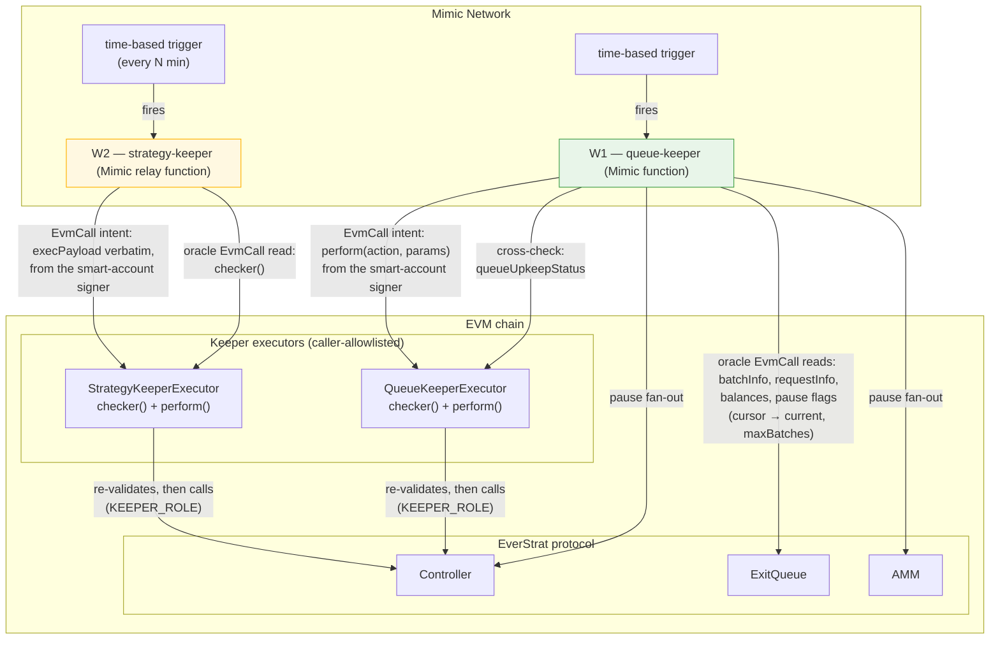
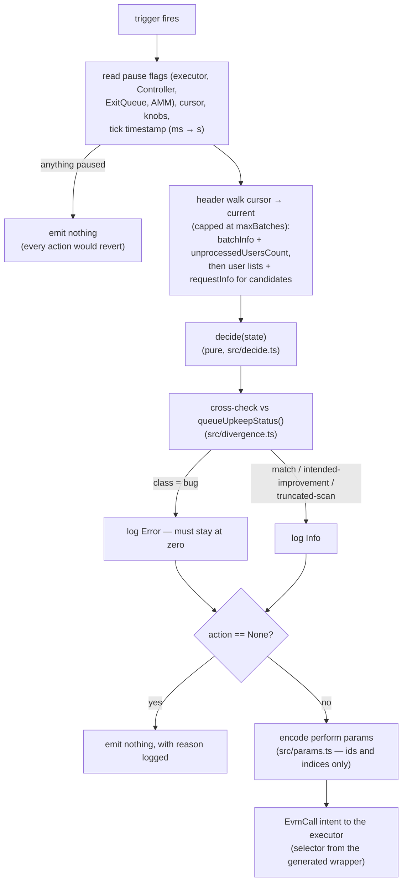

# 01 — System overview

How the components in this repo relate to Mimic and the EverStrat contracts.
Files: `mimic-functions/queue-keeper/`, `mimic-functions/strategy-keeper/`,
and the executors in
[`everstrat-xyz/contracts`](https://github.com/everstrat-xyz/contracts).

W1/W2 moved off Chainlink CRE when Automation was sunset and CRE turned out
not to be permissionless (a Gelato interlude ended the same way when Gelato
sunset its automation). W4 (freeze-watch) was a read-only CRE workflow and has
been removed rather than carried unmigrated — see the README.

## Why W1 decides off-chain and W2 does not

The *permission* to go deeper is in the contracts; with W1 as the only
performer it does not show up. See the README "Why the split".

- `MAX_BATCH_SCAN` is the same 25 as `MAX_LIVE_PRICED_BATCHES`. The view
  peeks 25 skippable then scans 25 — live work at ~`cursor+26` is in view.
- `_execute(ProcessRequests)` has no window. Every W1 `perform` also peeks
  +25 skippable, so this keeper cannot grow a dead prefix and then need the
  extra scan. A down W1 does not price, so `current` does not run away.
- W2's `_execute` uses the same bounded helpers as its view — a "truer"
  off-chain number would revert — so the function only relays `checker()`
  verbatim.

## The W1 tick shape

`mimic-functions/queue-keeper/src/function.ts`:

One clock, deliberately: `state.now` is Mimic `context.timestamp` (ms) divided
by 1000. Batch ages are `block.timestamp`. Mixing units skews every window by
1000×; the runner time is not `eth_getBlockByNumber`.
