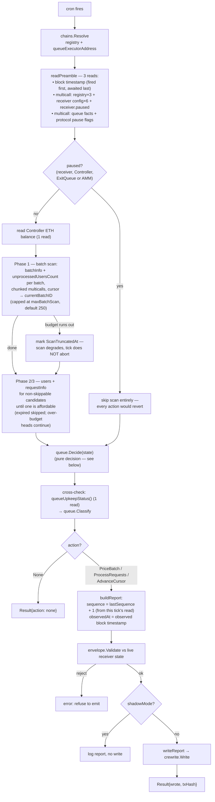
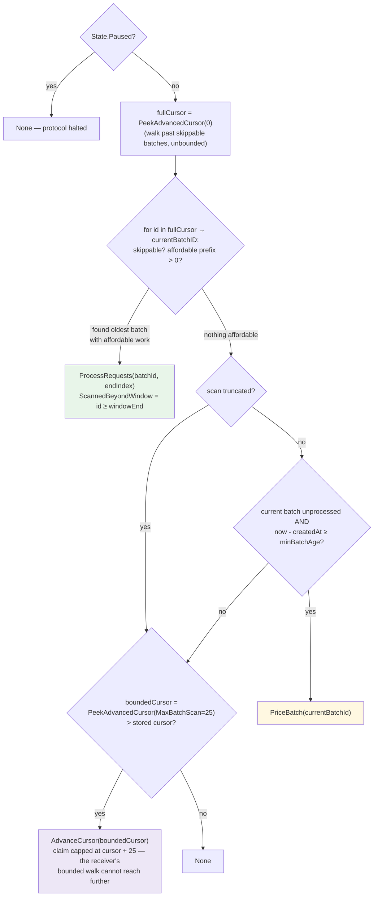
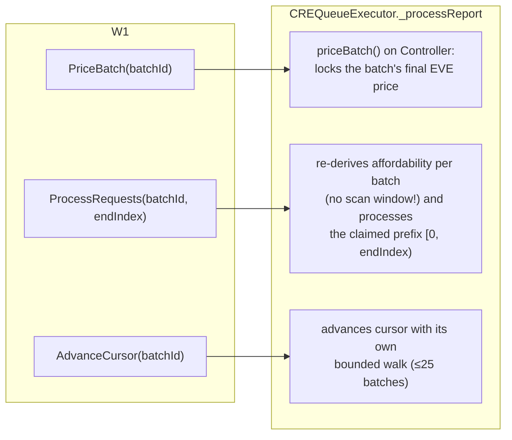
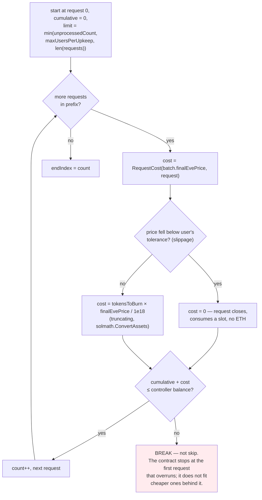
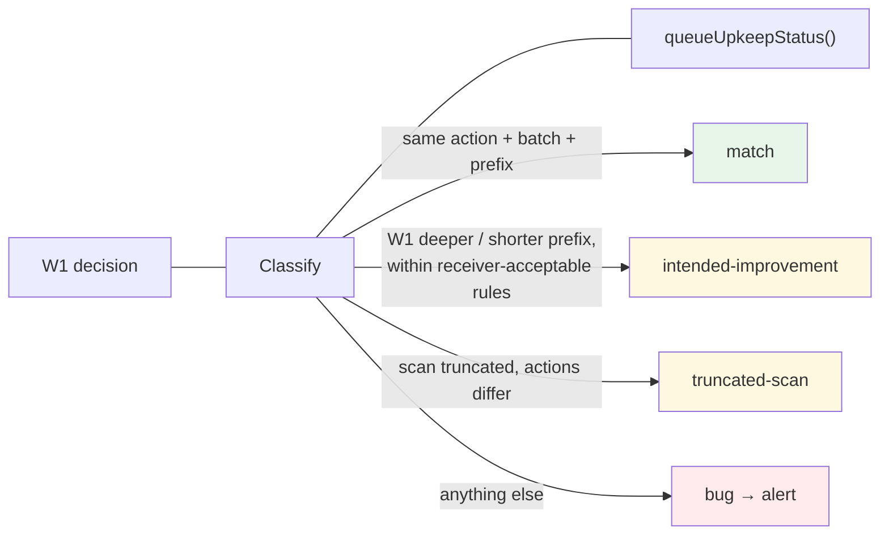
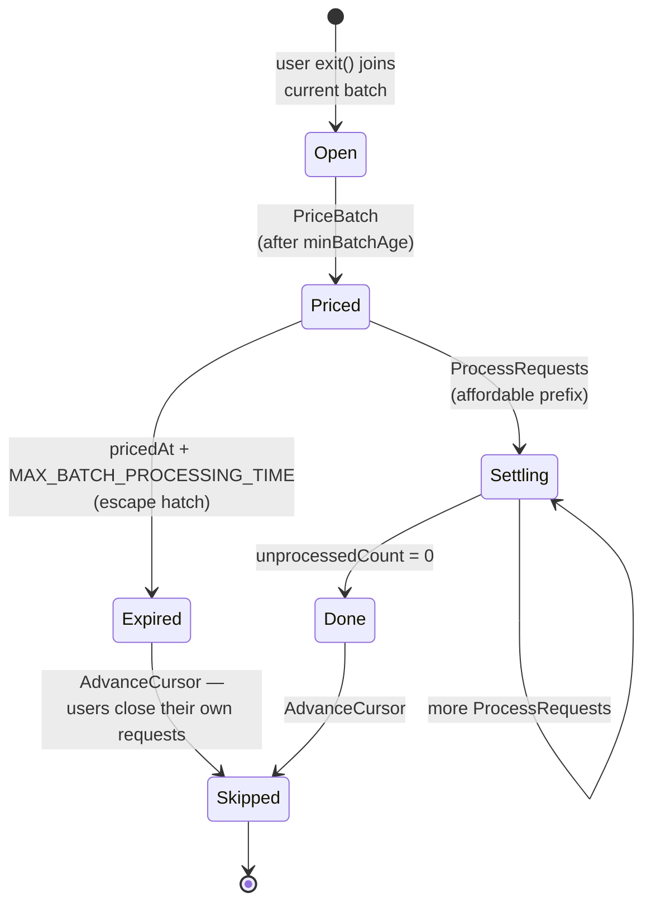

# 02 — W1 queue-keeper (exit-queue automation)

Receiver: `CREQueueExecutor`. Files: `queue-keeper/main.go`,
`queue-keeper/reads.go`, `queue-keeper/write.go`, `pkg/queue/decide.go`,
`pkg/queue/divergence.go`.

## Tick flow

## Decision tree — `queue.Decide` (pkg/queue/decide.go)

Mirrors `CREQueueExecutor.queueUpkeepStatus` branch order, **except** the scan
is unbounded (up to 250 batches) where the on-chain view stops at 25. That is
W1's entire reason to exist: `_processReport` validates a `ProcessRequests`
claim per batch with no scan window.

## The three actions and what the receiver does with them

## Affordability walk — `AffordableRequests` (must match the contract)

## Divergence classification — `queue.Classify`

Shadow mode's exit criterion is "zero `bug`-class divergences over 7 days"
(issue #5):

| Class | Meaning | Action |
| --- | --- | --- |
| `match` | Workflow and `queueUpkeepStatus()` agree | log info |
| `intended-improvement` | Workflow found work beyond the view's two-window reach (`OnChainScanWindowEnd`), or claimed a valid shorter prefix — the receiver accepts any prefix | log info, expected |
| `truncated-scan` | Read budget stopped the process walk short, so a missing `ProcessRequests` or a skipped `PriceBatch` is the workflow refusing to guess | log info, explained |
| `bug` | Anything else — off-chain model or read layer is wrong | log **error**, must stay at zero |

## Batch lifecycle context (what W1 is automating)

