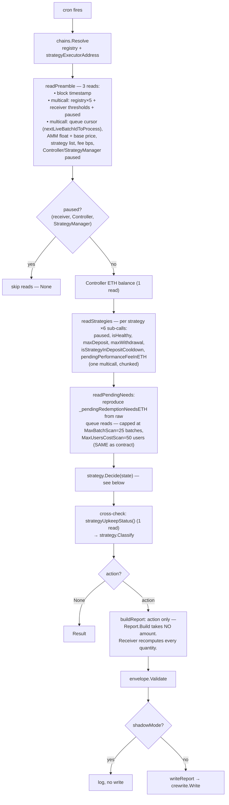
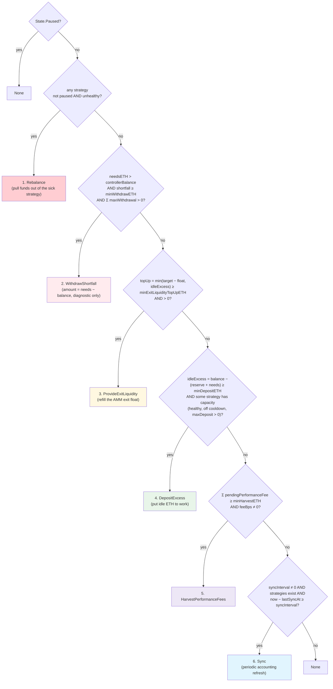
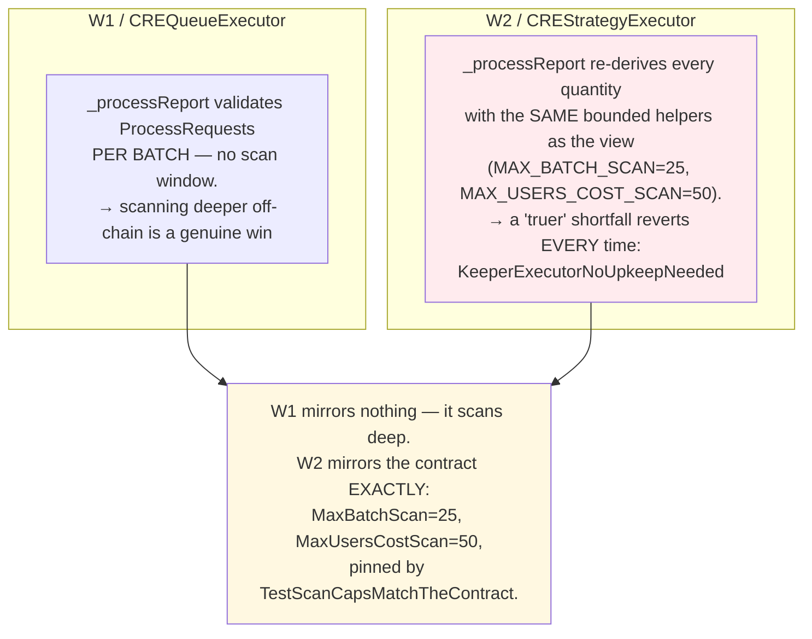
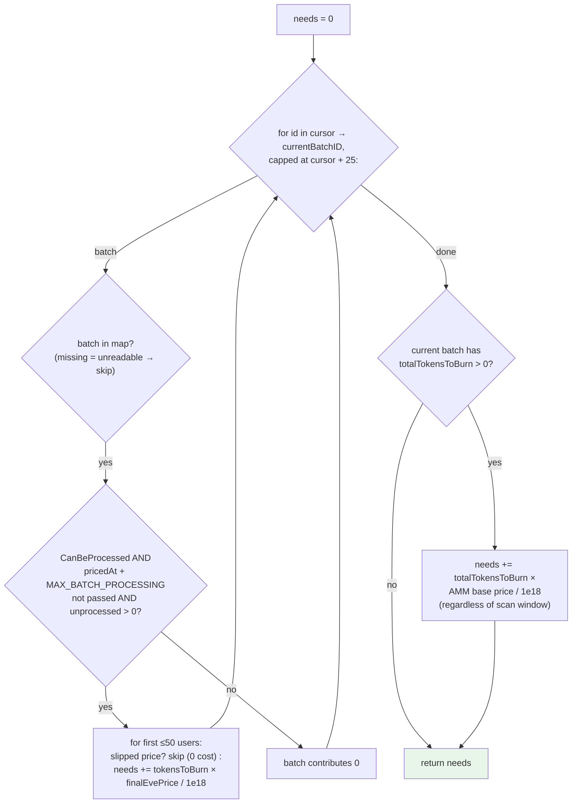

# 03 — W2 strategy-keeper (strategy automation)

Receiver: `CREStrategyExecutor`. Files: `strategy-keeper/main.go`,
`strategy-keeper/reads.go`, `pkg/strategy/decide.go`, `pkg/strategy/strategy.go`.

## Tick flow

## Decision tree — `strategy.Decide` (pkg/strategy/decide.go)

Mirrors `CREStrategyExecutor.strategyUpkeepStatus` **branch for branch, in
order**. First match wins.

Where the money-model helpers come from (`strategy.go`):

- `idleExcess(balance, needs)` = `max(0, balance − (controllerReserveETH + needs))`
- `exitLiquidityTopUp` = `min(exitLiquidityTargetETH − ammFreeBalance, idleExcess)`, 0 if float ≥ target
- `PendingRedemptionNeedsETH` — see below

## Why W2 must NOT scan deeper than the contract

The single most important asymmetry in this repo (see the long comment on
`strategy.Decide`):

## `PendingRedemptionNeedsETH` — what pending redemptions cost

Note the deliberate difference from W1's affordability walk: this sums every
request with **no balance budget and no early break** — it asks "what do
pending redemptions cost?", not "what can we afford right now?".

## Divergence classification — `strategy.Classify`

Same three-class scheme as W1 (`match` / `intended-improvement` / `bug`), but
for W2 there is no scan-window excuse: since the workflow mirrors the
contract's helpers exactly, the expected class is almost always `match`. Any
`bug` means the read layer or the transcription drifted — see
`pkg/strategy/divergence.go`.
