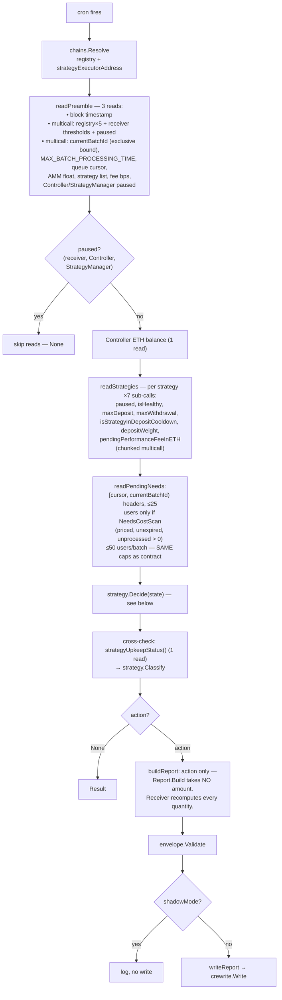
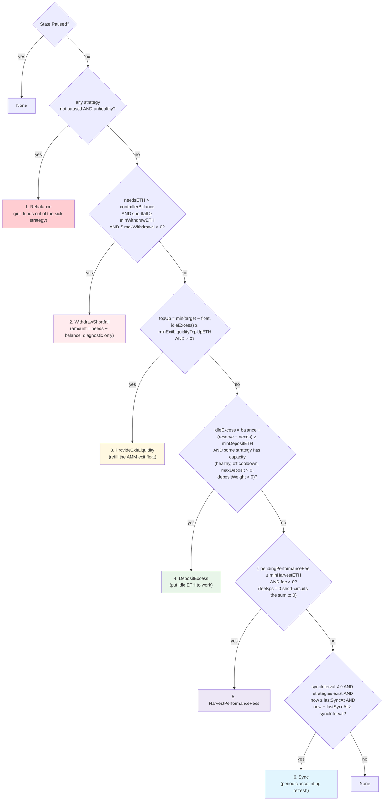
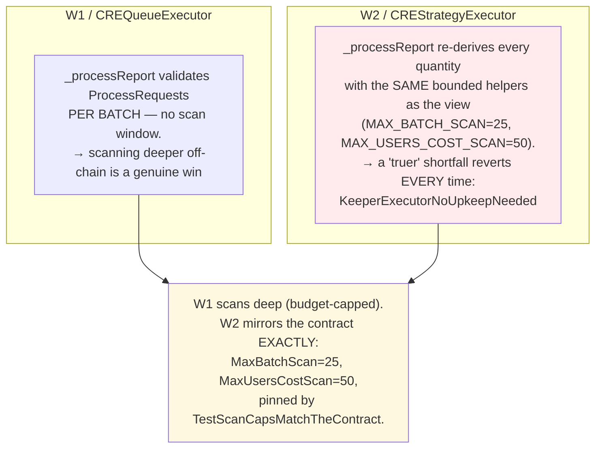
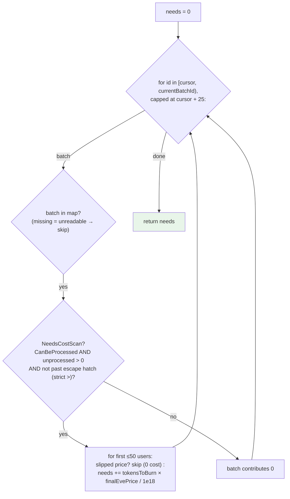

# 03 — W2 strategy-keeper (strategy automation)

Receiver: `CREStrategyExecutor`. Files: `strategy-keeper/main.go`,
`strategy-keeper/reads.go`, `pkg/strategy/decide.go`, `pkg/strategy/strategy.go`.

## Tick flow

`currentBatchId` is a bound, not a scan target. The current batch is unpriced
cancellable equity until `priceBatch` (contracts PR #43, M-11); costing it at
the AMM base price would propose `WithdrawShortfall` the receiver recomputes as
none. There is no `eveBasePriceInETH` read.

## Decision tree — `strategy.Decide` (pkg/strategy/decide.go)

Mirrors `CREStrategyExecutor.strategyUpkeepStatus` **branch for branch, in
order**. First match wins. Enum ordinals are a different order
(`ProvideExitLiquidity` is 6); `Priority` in `pkg/strategy/strategy.go` is this
tree.

Where the money-model helpers come from (`decide.go`):

- `idleExcess(balance, needs)` = `max(0, balance − (controllerReserveETH + needs))`
- `exitLiquidityTopUp` = `min(exitLiquidityTargetETH − ammFreeBalance, idleExcess)`, 0 if float ≥ target
- `depositCapacityAvailable` requires `depositWeight > 0` (R4-M-04): all-zero
  weights are registered-but-unfunded; the StrategyManager refunds the Controller
- `PendingRedemptionNeedsETH` — see below

## Why W2 must NOT scan deeper than the contract

The single most important asymmetry in this repo (see the long comment on
`strategy.Decide`):

If the 15-read budget cannot cover those contract caps, W2 does **not**
widen or invent a deeper figure. It truncates, understates `NeedsETH`, and
classifies the disagreement as `truncated-scan`.

## `PendingRedemptionNeedsETH` — what pending redemptions cost

Walk is `[cursor, currentBatchId)`, `id < cursor + 25`. Exclusive of the
current batch. Expired / empty / unpriced batches contribute 0 without a user
list (`NeedsCostScan`).

The current unpriced batch is **not** added at the AMM base price. That was
M-11: until `priceBatch` the queued EVE is cancellable equity
(`liveRedemptionOffsets` is zero). After `priceBatch`, `currentBatchId`
increments and the batch sits in the window, costed at `finalEvePrice`.

Note the deliberate difference from W1's affordability walk: this sums every
request with **no balance budget and no early break** — it asks "what do
pending redemptions cost?", not "what can we afford right now?".

## Divergence classification — `strategy.Classify`

Not W1's scheme. W2 has no "found work the view could not see" class, because
the receiver re-derives with the same caps. Classes are in
`pkg/strategy/divergence.go`:

| Class | Meaning | Action |
| --- | --- | --- |
| `match` | Same action and amount | log info |
| `amount-only` | Same action, different amount — the report carries no amount; the receiver recomputes | log info |
| `truncated-scan` | `ScanTruncated`: budget could not cover the bounded walk, so `NeedsETH` understates and the action may disagree | log info, explained |
| `bug` | Unexplained action disagreement — the report would revert | log **error**, must stay at zero |
