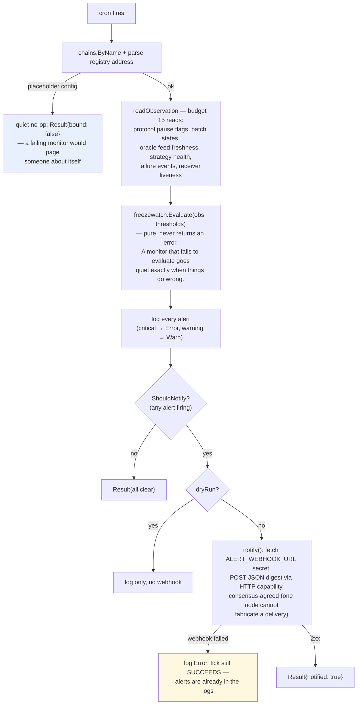
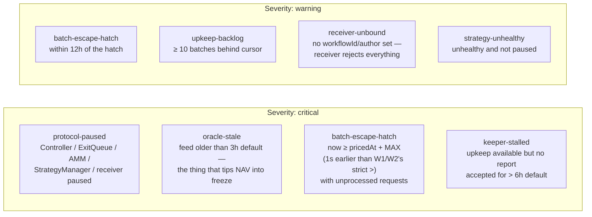

# 04 — W4 freeze-watch (observability, no writes)

Files: `freeze-watch/main.go`, `freeze-watch/reads.go`, `pkg/freezewatch/alerts.go`.

W4 is the silent-stop detector: it watches freeze precursors and keeper health
and posts an alert digest to a webhook. It **cannot write on-chain** — the
package imports neither `pkg/crewrite` nor `pkg/envelope`, so actuation would
require adding an import that is visible in review. NAV-guardian actuation is a
separate epic behind DAO sign-off (TECH_SPEC Phase 3).

## Tick flow

## Alert kinds — `freezewatch.Evaluate`

## Why each critical kind exists

| Kind | Failure mode it precedes |
| --- | --- |
| `protocol-paused` | Not a precursor — the protocol is already halted; every keeper action reverts |
| `oracle-stale` | NAV reads revert once the contract's own staleness bound is crossed; W4 fires *before* that (3h default) |
| `batch-escape-hatch` | After the hatch users must close their own requests; the keeper can no longer settle the batch. W4 fires at `now ≥ pricedAt + MAX` so ops see it ~1s before W1/W2/`_batchSettlementCost` (strict `>`) drop the batch from keeper work |
| `keeper-stalled` | The silent-stop mode: work exists, the receiver's own view says so, yet nothing arrives — the thing this workflow exists to catch |

## Liveness check detail — `KeeperHealth`

> **Contract-blocked:** `LastAcceptedAt` has no on-chain source — the receivers
> expose no `lastReportAcceptedAt()` view, so `readKeepers` cannot populate it
> and `keeper-stalled` never fires in production today. The unit tests set the
> field directly, which masked the gap. Unblocking requires a contract accessor
> in `everstrat-xyz/contracts`; see the CONTRACT-BLOCKED note on
> `pkg/freezewatch.KeeperHealth.LastAcceptedAt`.

A keeper is only considered stalled when **all three** hold:

1. `Bound` — the receiver has `expectedWorkflowId`/`expectedAuthor` set (an
   unbound receiver gets the `receiver-unbound` warning instead),
2. `UpkeepAvailable` — the receiver's own view currently recommends an action
   (no work → no stall),
3. `LastAcceptedAt` is older than `KeeperStalledAfter` (default 6h).

## Thresholds

Defaults (`DefaultThresholds`), overridable per-target in
`config.<target>.json`:

| Threshold | Default | Meaning |
| --- | --- | --- |
| `OracleStaleAfter` | 3h | feed age before warning — sits below the contracts' own staleness bound so the alert precedes the revert |
| `EscapeHatchWarnWithin` | 12h | warning window before `MAX_BATCH_PROCESSING_TIME` |
| `KeeperStalledAfter` | 6h | idle-with-work before `keeper-stalled` |
| `BacklogWarnBatches` | 10 | batches waiting behind the cursor |

Tuning guidance lives in `FREEZE_RUNBOOK.md`.
