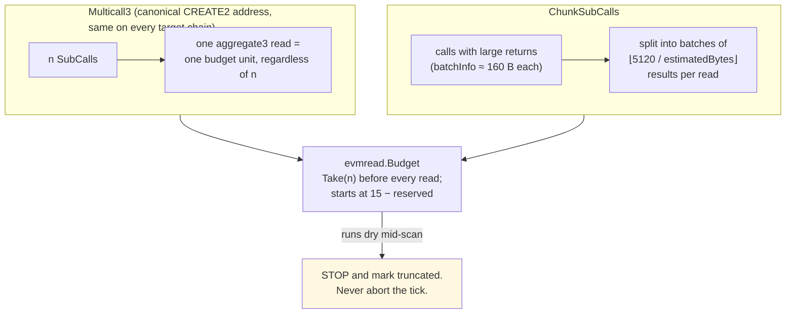
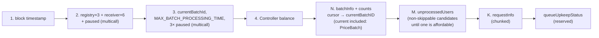
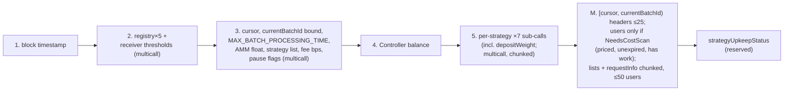

# 05 — The read budget

File: `pkg/evmread/multicall.go`, plus the read plans in
`queue-keeper/reads.go` and `strategy-keeper/reads.go`. See also
[`docs/READ_BUDGET.md`](../docs/READ_BUDGET.md).

## The constraint

CRE allows **15 contract reads per execution** (`ChainRead.CallLimit = 15`)
with a **5 kB response cap** per read (`PayloadSizeLimit`). Exceeding the
count aborts the *whole execution* with `Public:User:LimitExceeded` — no
partial result. This was discovered the hard way: the first read layer needed
~16 calls before touching a single batch.

## The two mechanisms that stretch it

Degradation contract: a scan that runs out of budget **truncates and says so**
(`scanTruncated=true` in the tick log, `ScanTruncatedAt` in state). A
truncated scan can only *under-propose* work — never propose wrong work.

## W1's read plan

Budget bookkeeping (`queue-keeper/reads.go`):

- `reservedReads = 2` held back for the cross-check view + write-path margin
- Phase 1 keeps `Remaining() − 2` for the user/request phases — batches found
  without the reads to evaluate them are worse than batches not found
- Users are read for **non-skippable** priced batches, oldest first, until
  one has an affordable prefix — the same walk as `Decide` /
  `queueUpkeepStatus`. Expired heads skip the user read; an over-budget
  in-window head is not skippable, so the next candidate is loaded rather
  than stalling. Once a batch is affordable, later ids cannot be chosen
  this tick.
- Healthy small queues finish with 5–8 reads spare

## W2's read plan

Unlike W1, W2's scan width is **not** budget-driven — it is contract-driven
(`MaxBatchScan=25`, `MaxUsersCostScan=50`). Phase 1 walks
`[cursor, currentBatchId)` headers only (the current unpriced batch is not a
liability). Phase 2 loads users only for priced, unexpired batches with work.
If the budget cannot cover the bounded scan, the tick records
`ScanTruncated=true` and `NeedsETH` may understate — surfaced via the
divergence classification rather than silently changing the decision.

## What a pinned budget test looks for

`TestReadPlanFitsBudget` (`pkg/evmread`) is W1 arithmetic: the fixed preamble
plus cross-check must still leave a scan deeper than the on-chain 25-batch
window. Adding a preamble read without updating it fails CI, not production.
W2's width is the contract cap (`TestScanCapsMatchTheContract`), not leftover
budget.
