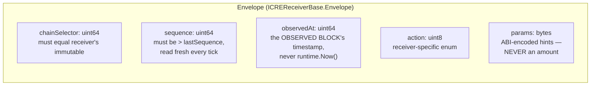
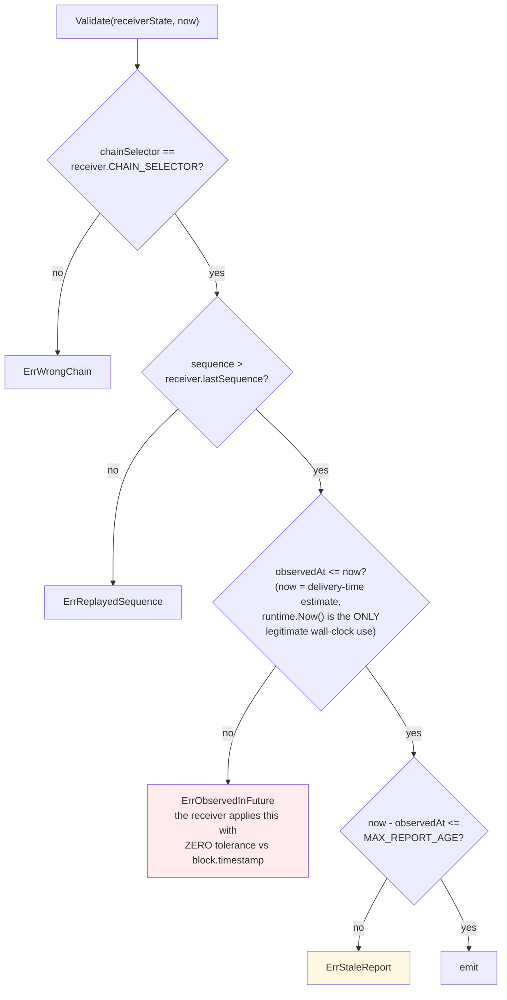
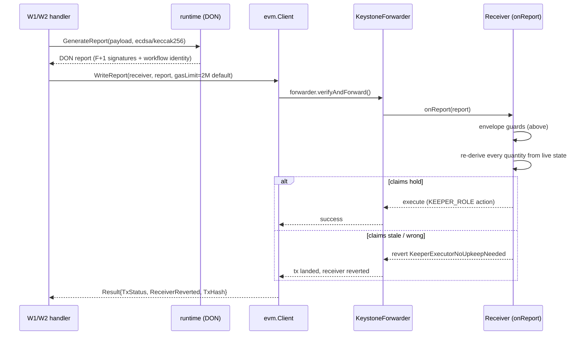
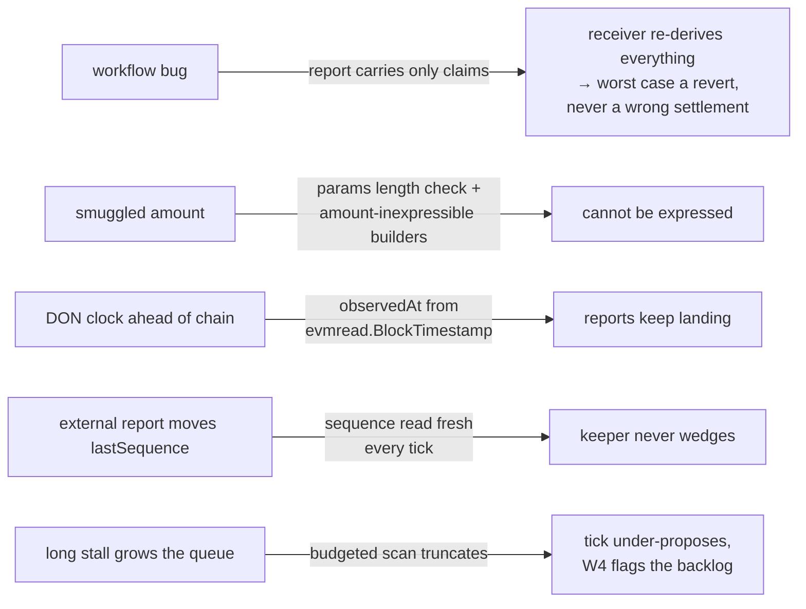

# 06 — Report lifecycle: envelope → DON signature → receiver

Files: `pkg/envelope/envelope.go`, `pkg/crewrite/crewrite.go`,
`pkg/queue/queue.go` (params encoding), `pkg/strategy/strategy.go` (Report.Build),
and the receivers' `CREReceiverBase.onReport`.

## The envelope

The wire format is exactly `abi.encode(Envelope)` — one dynamic tuple:

**The hard constraint:** `params` carries claims and hints only. No ETH
amount, NAV, or price can appear — the builders make it inexpressible:

- `pkg/queue` params take only batch ids and an end index, all `uint64`, and
  `DecodeParams` enforces the **exact** wire length per action (a smuggled
  amount could only appear as a trailing word that Solidity's `abi.decode`
  would silently ignore).
- `pkg/strategy`'s `Report.Build` takes an action and *nothing else*.

## Pre-flight validation — `envelope.Validate`

Applied against the receiver's **live** state before emitting, so a report
the contract would reject never leaves the workflow:

## Sequence — `NextSequence`

`sequence` is **not** workflow-owned state. A break-glass multisig report, a
receiver redeploy, or overlapping workflow versions all move `lastSequence`.
So every tick reads `lastSequence()` from the receiver and proposes
`lastSequence + 1` — a local counter would leave the keeper permanently
behind, with every report rejected as a replay.

## Delivery — `crewrite.Write`

Three outcomes the workflows distinguish (`crewrite.Result`):

| Outcome | Treated as |
| --- | --- |
| tx landed + receiver accepted | success — `Result.Wrote = true` |
| tx landed + receiver reverted (`KeeperExecutorNoUpkeepNeeded`) | successful *tick* with a warning — state moved between observation and delivery; alert on the *rate*, not the occurrence (W4, issue #7) |
| tx failed | workflow error |

## Why the whole design hangs together

